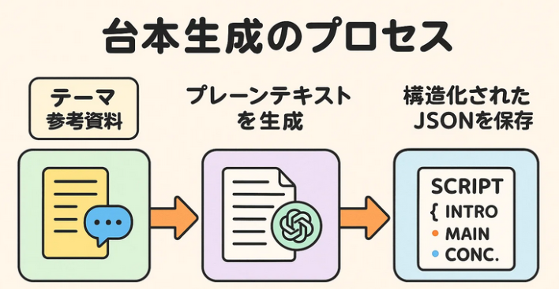
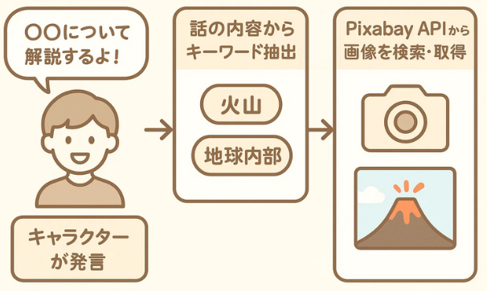

<!-- スライド1 -->
# アプリ開発成果報告  
### 氏名：池辺志槻  
### 学籍番号：23C1064

---

<!-- スライド2 -->
## 1. 作成したアプリ

- ゆっくり解説動画を**プログラムだけで作れる！**
- GUIの動画編集が不要！
- 解説系YouTuberの動画制作を**もっと簡単に！**

---

<!-- スライド3 -->
## 2. 何ができる？

- 台本を自動で作ってくれる！
- 解説音声（TTS）も自動で作れる！
- 画像も自動で探してくれる（もちろん自分でも選べる）
- 最後に全部まとめて動画に！

📌 **ゆっくり解説の全自動パイプラインを作成しました**

---

<!-- スライド4 -->
## 4. どうやって動画を作るのか

- 通常：動画編集ソフトで手作業
- このアプリ：Pythonで動画を**自動生成**

**📦 台本 → 🎤音声合成 → 🖼 画像取得 → 🎬動画出力**

---

<!-- スライド5 -->
## 4-① 台本生成をどうやって実装するか？
- GPTを使って**要点リストやスクリプトを生成**
- 構造化されたJSONで管理もラクラク！
- 参考資料を渡せば**精度もアップも可能**

---

<!-- スライド6 -->
## 4-② 画像の取得

- キャラクターの喋る内容からキーワードを抽出
- Pixabay APIでキーワドを用いて**著作権OKな画像**を自動取得

---

<!-- スライド7 -->
## 4-③ 音声合成：ずんだもんの声を作る！

- 台本の文章を **自動で読み上げ音声に変換** (VOICEVOX API)
- 読み間違いしやすい言葉（例：人名・英単語など）も
- GPTを使って **ふりがな付きの読み方を生成**

---

<!-- スライド8 -->
## 完成品

- 自動生成された動画、与えたのは「テーマ」と「参考資料」

📽️ デモ

---

<!-- スライド9 -->
## 5. 開発を通じて得られた知見

- 処理の並列化（multiprocessing）により**音声合成の実行時間を大幅に短縮**
- 音声・画像・字幕間の同期処理に苦戦し、**非同期処理の制御ロジック**を学習
- API連携（Pixabay・VOICEVOX）を通じて、**データ取得と例外処理の重要性**を体感
- 台本の構造化・JSON化を通じて、**拡張性と再利用性を意識した設計力**

---

<!-- スライド10 -->
## 6. 今後の展望とまとめ

- ユーザーが直感的に操作できる **GUIエディタの実装**を次のステップに検討
- 台本構成・音声・キャラクターの制御を統合した**演出ツールへの発展性**

🎓 「生成AI時代に求められるスキルを、“実装”という形で実感できた」
